# 支付宝支付集成指南

## 🎯 概述

本指南将帮助你在 Nano Banana 项目中集成支付宝支付功能，支持中国用户进行在线支付。

## 📋 前置条件

### 1. 支付宝开放平台账户
- 注册地址：https://open.alipay.com
- 完成个人开发者认证
- 创建应用并获取密钥

### 2. 必需信息
- 应用ID (APP_ID)
- 应用私钥 (PRIVATE_KEY)
- 支付宝公钥 (ALIPAY_PUBLIC_KEY)
- 网关地址 (GATEWAY_URL)

## 🚀 快速开始

### 1. 配置环境变量

在 `.env.local` 文件中添加以下配置：

```bash
# 支付宝支付配置
ALIPAY_APP_ID=your_alipay_app_id
ALIPAY_PRIVATE_KEY=your_alipay_private_key
ALIPAY_PUBLIC_KEY=your_alipay_public_key
ALIPAY_GATEWAY_URL=https://openapi.alipay.com/gateway.do
ALIPAY_NOTIFY_URL=https://your-domain.com/api/payment/alipay/callback
ALIPAY_RETURN_URL=https://your-domain.com/payment/success
```

### 2. 安装依赖

```bash
npm install alipay-sdk
```

### 3. 测试支付功能

访问测试页面：http://localhost:3000/alipay-test

## 🔧 代码结构

### 核心文件

```
src/
├── lib/
│   └── alipay-payment.ts          # 支付宝支付服务类
├── app/
│   └── api/
│       └── payment/
│           └── alipay/
│               ├── route.ts       # 创建支付订单API
│               └── callback/
│                   └── route.ts   # 支付回调处理API
├── components/
│   └── payment/
│       └── alipay-payment.tsx     # 支付宝支付组件
└── app/
    └── alipay-test/
        └── page.tsx               # 支付测试页面
```

## 💻 使用方法

### 1. 创建支付订单

```typescript
import { createAlipayPayment } from '@/lib/alipay-payment';

const result = await createAlipayPayment(
  'ORDER_123456789',           // 商户订单号
  99.99,                       // 支付金额
  'Nano Banana 会员充值',       // 订单标题
  'https://your-domain.com/payment/success',  // 同步回调地址
  'https://your-domain.com/api/payment/alipay/callback'  // 异步回调地址
);

if (result.success) {
  // 跳转到支付页面
  window.location.href = result.paymentUrl;
}
```

### 2. 查询支付结果

```typescript
import { queryAlipayPayment } from '@/lib/alipay-payment';

const result = await queryAlipayPayment('ORDER_123456789');

if (result.success) {
  console.log('支付成功:', result.tradeNo);
}
```

### 3. 验证支付回调

```typescript
import { verifyAlipayCallback } from '@/lib/alipay-payment';

const isValid = verifyAlipayCallback(callbackParams);

if (isValid) {
  // 处理支付成功逻辑
  console.log('支付验证成功');
}
```

## 🔄 支付流程

### 1. 创建支付订单


```mermaid
graph LR
    A[用户点击支付] --> B[调用创建支付API]
    B --> C[生成支付参数]
    C --> D[生成签名]
    D --> E[返回支付链接]
    E --> F[跳转到支付宝]
```

### 2. 支付回调处理

```mermaid
graph LR
    A[支付宝支付完成] --> B[发送异步通知]
    B --> C[验证签名]
    C --> D[更新订单状态]
    D --> E[返回成功响应]
```


## 🛠️ API 接口

### 创建支付订单

**POST** `/api/payment/alipay`

**请求参数：**
```json
{
  "outTradeNo": "ORDER_123456789",
  "totalAmount": 99.99,
  "subject": "Nano Banana 会员充值",
  "body": "购买专业版会员，获得200积分",
  "returnUrl": "https://your-domain.com/payment/success",
  "notifyUrl": "https://your-domain.com/api/payment/alipay/callback"
}
```

**响应：**
```json
{
  "success": true,
  "data": {
    "paymentUrl": "https://openapi.alipay.com/gateway.do?...",
    "outTradeNo": "ORDER_123456789"
  }
}
```

### 查询支付结果

**GET** `/api/payment/alipay?outTradeNo=ORDER_123456789`

**响应：**
```json
{
  "success": true,
  "data": {
    "outTradeNo": "ORDER_123456789",
    "tradeNo": "2023120122001234567890123456"
  }
}
```

### 支付回调

**POST** `/api/payment/alipay/callback`

**回调参数：**
```json
{
  "out_trade_no": "ORDER_123456789",
  "trade_no": "2023120122001234567890123456",
  "trade_status": "TRADE_SUCCESS",
  "total_amount": "99.99",
  "sign": "signature_string"
}
```

## 🔒 安全配置

### 1. 签名验证

所有支付回调都会进行签名验证，确保数据安全：

```typescript
const isValid = verifyAlipayCallback(callbackParams);
```

### 2. 环境变量保护

确保敏感信息存储在环境变量中，不要硬编码在代码里：

```bash
# 生产环境
ALIPAY_APP_ID=your_production_app_id
ALIPAY_PRIVATE_KEY=your_production_private_key
ALIPAY_PUBLIC_KEY=your_production_public_key

# 测试环境
ALIPAY_APP_ID=your_sandbox_app_id
ALIPAY_PRIVATE_KEY=your_sandbox_private_key
ALIPAY_PUBLIC_KEY=your_sandbox_public_key
```

### 3. HTTPS 要求

生产环境必须使用 HTTPS，支付宝不支持 HTTP 回调。

## 🧪 测试

### 1. 沙箱环境测试

使用支付宝沙箱环境进行测试：

```bash
# 沙箱环境配置
ALIPAY_GATEWAY_URL=https://openapi-sandbox.dl.alipaydev.com/gateway.do
```

### 2. 测试账号

使用支付宝提供的测试账号进行支付测试。

### 3. 测试页面

访问 http://localhost:3000/alipay-test 进行功能测试。

## 🚨 常见问题

### 1. 签名验证失败

**原因：** 私钥或公钥配置错误
**解决：** 检查环境变量配置，确保密钥正确

### 2. 支付回调失败

**原因：** 回调地址不可访问或HTTPS证书问题
**解决：** 确保回调地址可访问且使用HTTPS

### 3. 订单号重复

**原因：** 使用了相同的商户订单号
**解决：** 确保订单号唯一性

### 4. 金额格式错误

**原因：** 金额格式不正确
**解决：** 确保金额为数字格式，保留两位小数

## 📚 相关文档

- [支付宝开放平台](https://open.alipay.com)
- [支付宝开发文档](https://opendocs.alipay.com)
- [支付宝沙箱环境](https://openhome.alipay.com/platform/appDaily.htm)

## 🔄 更新日志

### v1.0.0 (2024-01-01)
- 初始版本
- 支持支付宝网页支付
- 支持支付回调处理
- 支持支付结果查询

---

*如有问题，请联系技术支持：nano_banana_service*


